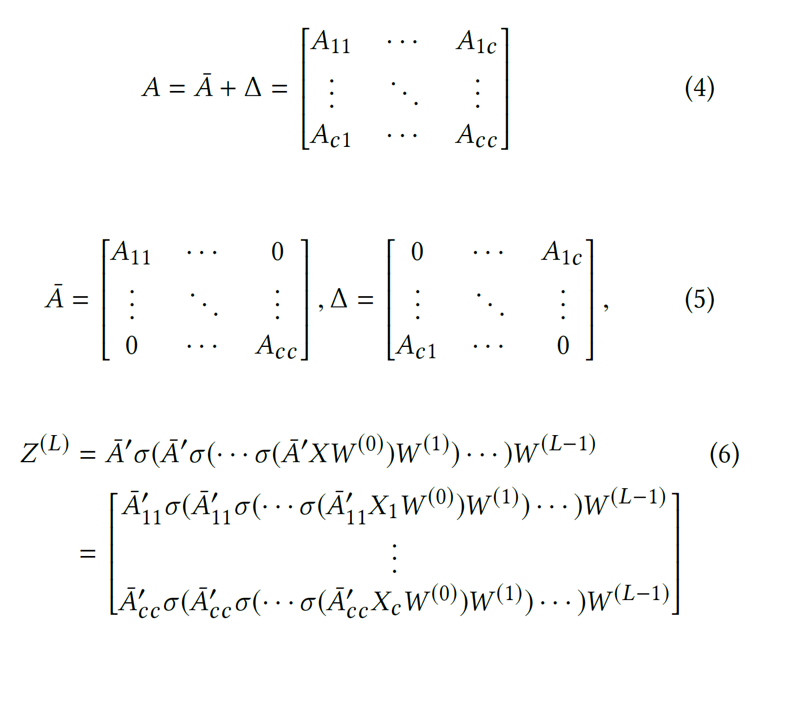

对大规模图上的GCN训练进行改进
思路：每一步都对一个与（由图聚类算法识别的）稠密子图关联的节点块进行采样，并且限制在该子图邻域上的搜索
GCN的训练需要保存每一层上的每个node上的embedding来计算梯度：
* Full-batch SGD：GCN，全梯度下降，其损失函数必须依赖大量的其他节点，其反向传播时需要计算Graph上的所有embedding，需要存储空间$O(NFL)$
* Mini-batch SGD：graphSage，FastGCN每次更新基于一个batch的梯度，但是随着层数加深指数增长
* VRGCN：用vatiance reduction减小邻域采样点的大小，但是仍然需要在内存中存入所有节点的embemdding，开销$O(NFL)$

文章使用embedding utilization(嵌入利用率)来衡量mini-batch算法的效率：嵌入利用率与batch或within-batch内的节点的链接数量成正比。故算法目标是找到合适的划分方法，使同一分区中节点间链接数比不同分区更多。且文章算法的内存开销仅$O(bFL)$，在计算复杂度上，cluster-GCN与层数为线性关系，而VRGCN为指数关系

如果节点i在l层的嵌入在l+1层用了u次，则其嵌入利用率为u（与边数目正相关），目标是设计图聚类算法来提高嵌入利用率

Vanilla Cluste-GCN
用聚类算法如metis和graclus将图进行聚类，得到若干sub-graph，使得sub-graph内部的边尽量多，sub-graph之间的边尽量少

得到的子图分割如公式(4)，整个图的邻接矩阵表示如公式(5)，其中对角线上的子矩阵$A_{tt}$是第t个子图上的邻接矩阵，$A_{st}$是子图i和j之间的边，同理可以将整个图的节点的特征向量进行划分。最后用$\bar{A}$**近似表示**原来的图的邻接矩阵$A$，将归一化之后的邻接矩阵$\bar{A^{'}}$并分解得到在batch上的结构如公式(6)

以上算法有两个问题：
1. 分割之后，簇之间的边会丢失，影响模型表现
2. 图聚类算法原本就倾向于将相似节点划分到一起，因此簇的分布可能与原先的数据集不同，导致在进行SGD更新时对全局梯度的估计有偏差。
也就是说聚类算法得到的簇中的标签趋向于同一类别，其熵值很小，可能影响训练的收敛速度（类似在训练时每次input同一种标签的数据，使得影响梯度朝某个方向下降，而不是向着loss最小的方向）
解决：
使用Stochastic Multiple Partitions算法，每次从簇（即sub-graph）中随机选若干个进行训练