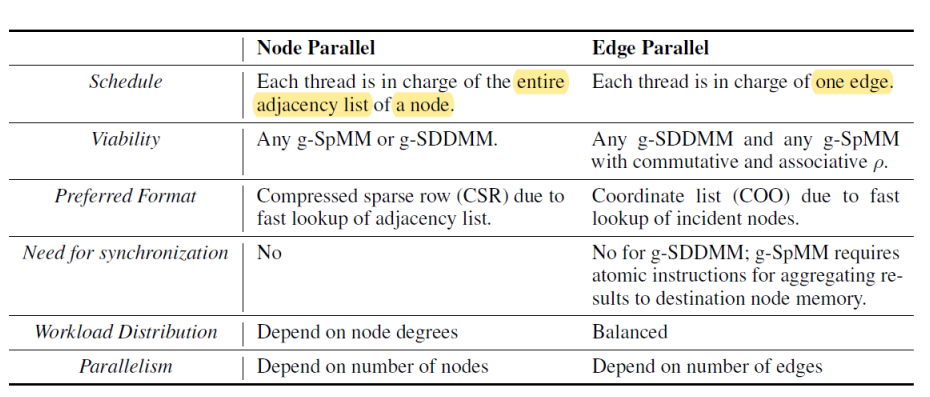

思路：从GNN运算模式提取出广义稀疏张量计算，便于进行并行化

motivation：
GNN与传统的tensor为中心的**DL存在语义差距和**效果差距，这体现在图的**稀疏性**带来的计算和存储方式和为了密集张量计算而设计的底层硬件

主要的contribution：
将GNN的运算模式提取为用户定义的计算原语，囊括了前向推导路径和反向传播的梯度计算，同时还定于与开发了并行策略

消息传播范式：
将各种GNN整合为message passing paradigm
* edge-wise**传递**边与相连的节点的信息
* node-wide**聚合**来自边的信息并且更新节点

GNN的消息传播范式与SpMM、SDDMM：
消息传播范式与稀疏矩阵运算密切相关，以GCN为例
* 其node-wise的运算$Y=AX$，可以看作sparse-dense matrix multiplication(**SpMM**)，即稀疏矩阵与稠密矩阵相乘；将点相关的边的特征聚合到点上，A是稀疏的邻接矩阵，X是稠密的特征矩阵
* 而GNN计算边权常用attention weight，可以用sampled dense-dense matrix multiplication (**SDDMM**)运算$W=A\odot(XX^{T})$，括号内两稠密矩阵相乘，然后与一个稀疏矩阵运算；它将边上节点的的特征映射到边的特征上
* g-SpMM，聚合点相关的边的特征得到点的特征，$Y=AX$即可
* g-SDDMM，计算边的特征，有$XX^{T}$相当于点与点的特征相乘，用到了点的特征；用稀疏矩阵mask$A$做$\odot$，相当于用边权赋值，即用到了边的特征，在**attention**机制中使用，如**GAT**中使用
* 正向路径中的g-SDDMM和g-SpMM的梯度计算本身也可以用g-SDDMM和g-SpMM的形式表述和计算，利于并行化和自动调整

对SpMM、SDDMM本身进行并行化的难点：计算访存比低；算法多样且没有突出的，可以作为算子调度

策略：

架构设计思想：

为了保持平台中立性，在tf和pytorch等平台之上构建独立接口

在GNN操作中，稀疏张量的存储和计算是性能和可用性最高的地方，在DGL最初的版本中直接用了框架（tf&pytorch）中的稠密张量来表示稀疏张量，后来自行实现。

DGL图点特征和边特征的输入输出使用FGLGraph，operation使用tf/Pytorch/MXNet的框架自动微分，并且使用DLGraph在框架之间共享

DGL相较于PYG的优点之一：消息融合
边的数量极大，要存储边的特征带来很大的存储和访存开销。

## 探索方向：
* 底层优化：合理的稀疏矩阵算法（主要的稀疏矩阵的乘法），主要是对SpMM、SDDMM优化，但是对呀大图，邻接矩阵$A$本身就很大，此时是否可以具备并行或者分布式计算的必要？此外对于大图，常用采样的方法
* operator的定义，对现有的node-wise、edge-wise的运算进行拆分、融合
* operator分布式部署，
    * 模型并行：子图划分/图采样，分别进行计算等思路，DGL是方法是对图采样得到子图，进行分发，底层用的pytorch
    * 数据并行
* 云上部署，将GNN的训练或者服务部署到云端？