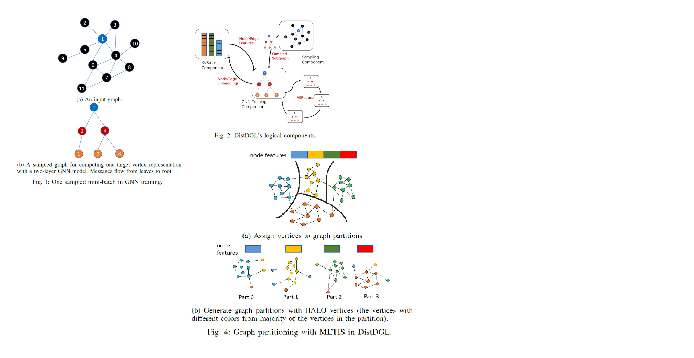

## intro
* 使用同步训练方法(synchronous training approach）
* 特点：高质量、轻量级的图分割算法，多个平衡性约束，以减少通信（复制halo节点、稀疏嵌入更新）并且平衡计算

首先，GNN的问题在于：
* CV和NLP这样的传统机器学习任务的样本通常是互相独立的，而图数据则要内在的表示样本之间的内在关系（点和边）。其每个batch需要包含其中起到决定作用的样本，而这样的样本数量与要用到的邻居节点的hop数成**指数关系**，因此需要用**采样算法**来将GNN扩展到大规模图上，来保证在精确获取GNN节。
* 此外与**传统分布式机器学习**不同，由于获取节点特征时候需要大量多个hop内的邻居节点信息，传输梯度数据会占用大量的**网络流量**。
* 此外，分布式训练框架常用同步SGD算法，需要分布式GNN框架生成包含数量均衡的节点、边、网络以及传输数据的batch，而一个图中的子图结构复杂，很难做到均衡。
* 此前的框架方向的困境：
    * full-batch SGD，全批次样本更新梯度，进行图分割来适应多设备的聚合内存
    * 获取邻居节点数据需要大量网络带宽
    * 此前的分布式学习框架通过网络传输来交换梯度数据，而因为GNN的节点依赖问题，获取邻居节点数据带来的网络带宽本就是GNN训练的一大瓶颈，故传统分布式框架不适用。

遵循同步训练方式，允许自我中心网络(ego-network)形成mini-batch来包含非本地节点；同时采用METIS来分割图（以最小边割集）；使用多约束分区和2层的工作负载拆分来进行load balance；同时通过复制分区图结构的的halo节点来减少采样过程的网络通信

## background：
* 消息传播模型
* mini-batch：典型的GNN上的小批量训练如下：
    * 采样：从训练集中均匀随机的采样目标节点(target vertices)
    * 对**每个**目标节点随机选择K个邻居(称作fan-out)
    * 在fan-out上进行消息传播过程
    * 如上的采样策略得到一个小的图来作为mini-batch[fig1]，此外还有很多不同的采样方法

## DistDGL架构概览：
* 分布式训练架构[fig2]: 采用随机梯度下降(SGD)，每台机器计算自己的mini-batch的梯度，同步梯度，更新本地的模型副本。构成部件有：
    * 若干sampler采样器，获取mini-batch子图
    * KVstore，分布式存储点、边数据，也可以保留点的embedding信息
    * 若干训练器trainer，通过mini-batch计算参数的梯度。在每个iteration，从sampler获取mini-batch子图，从KVstore获取相应点、边的特征，进行前向计算和反向传播获取参数梯度，梯度将分别处理：
        * 对于稠密参数（稠密矩阵？）的梯度，将发送到稠密模型更新组件
        * 稀疏的embedding的梯度将送到KVstore
    * 稠密模型更新组件dense model update component，用于聚合(aggregate)稠密GNN参数来执行同步的SGD，这部分可能是All-reduce（当后端用pytorch），或者paramer server（用tf）

为了减少通信，采用owner-compute规则，尽量把计算安排给相应数据的拥有者。通常是在每台机器上起sampler和KVstore来为本地分割数据服务，tainer负责机器上的本地分割数据的计算

* 图分割：训练前的预处理，要求各个分区之间的边尽量的少，同样的使用METIS进行分区，此外分区相关联的边也纳入分区中，这会有部分点重复[fig3]，其中METIS分配的称为核心点(Core vertices)，因为分配边而重复的称为光晕点(Halo vertices).默认情况下的METIS仅仅保证了核心点的平衡，不足以产生相同的batch数目和大小，这里将问题描述为多分区约束问题。

工作方向：
* 采样算法：将大图拆分为子图
* 获取节点特征时候需要大量多个hop内的邻居节点信息，此时交换模型的梯度参数需要占用大量网络流量